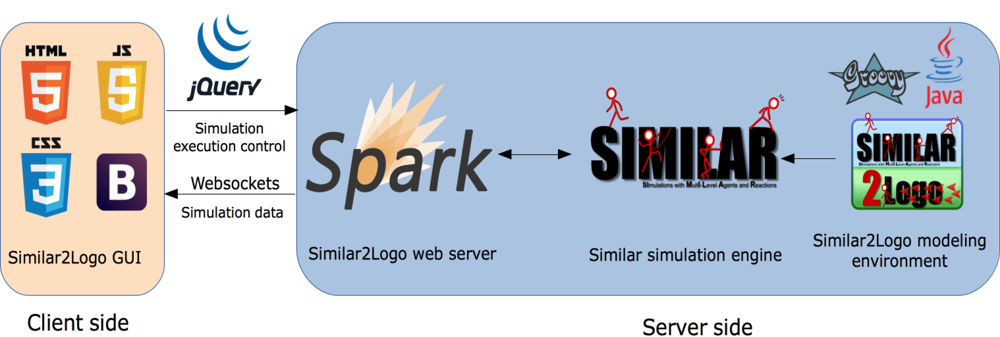
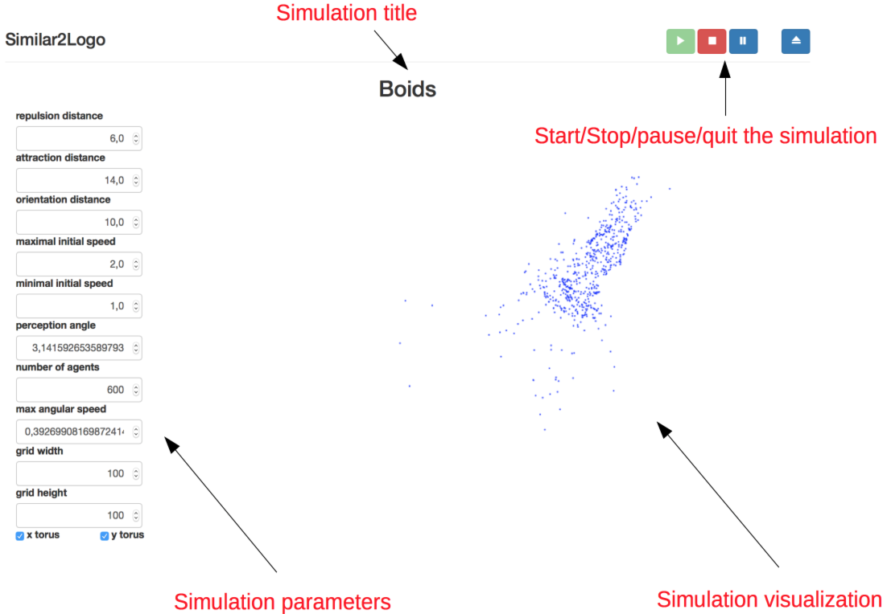
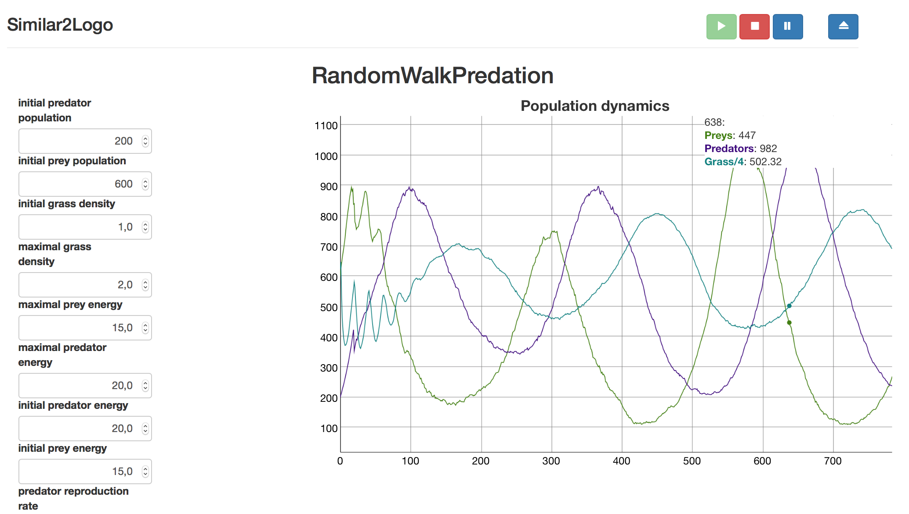

# Similar2Logo

Similar2Logo is a Logo-like **multiagent-based simulation environment** based on the [SIMILAR](http://www.lgi2a.univ-artois.fr/~morvan/similar.html) API and released under the [CeCILL-B license](http://cecill.info).

Similar2Logo is written in [Java](https://en.wikipedia.org/wiki/Java_(software_platform)). The GUI is based on web technologies ([HTML5](https://en.wikipedia.org/wiki/HTML5)/[CSS](https://en.wikipedia.org/wiki/Cascading_Style_Sheets)/[js](https://en.wikipedia.org/wiki/JavaScript)). Simulations can be developed in Java, [Groovy](https://en.wikipedia.org/wiki/Groovy_(programming_language)) or any [JVM language](https://en.wikipedia.org/wiki/List_of_JVM_languages).

The purpose of Similar2Logo is not to offer a fully integrated agent-based modeling environment such as [NetLogo](http://ccl.northwestern.edu/netlogo/), [Gama](http://gama-platform.org), [TurtleKit](http://www.madkit.net/turtlekit/) or [Repast](https://repast.github.io) but to explore the potential of

* the **influences/reaction model**, developed by the [SMILE](http://www.lirmm.fr/recherche/equipes/smile) team of [LIRMM](http://www.lirmm.fr) lab at [Université de Montpellier](http://www.umontpellier.fr),

* the [**interaction-oriented modeling**](http://www.cristal.univ-lille.fr/SMAC/projects/ioda/) approach developed by the [SMAC](http://www.cristal.univ-lille.fr/SMAC/) team of [CRISTAL](http://cristal.univ-lille.fr) lab at [Université de Lille](https://www.univ-lille.fr),

* **web technologies** to produce portable simulations.

To understand the philosophy of Similar2Logo, it might be interesting to first look at the [SIMILAR documentation](http://www.lgi2a.univ-artois.fr/~morvan/similar/docs/README.html) and read the papers about the [influences/reaction model](http://www.aaai.org/Papers/ICMAS/1996/ICMAS96-009.pdf), the [IRM4S (Influence/Reaction Principle for Multi-Agent Based Simulation) model](http://www.aamas-conference.org/Proceedings/aamas07/html/pdf/AAMAS07_0179_07a7765250ef7c3551a9eb0f13b75a58.pdf) and the [interaction-oriented modeling](https://hal.inria.fr/hal-00825534/document) approach.


## Contents of the README

* [License](#license)

* [Contributors](#contributors)

* [Technical architecture of Similar2Logo](#architecture)

* [Compiling and running Similar2Logo](#compile)

* [Develop your own agent-based models](#develop)

	* [Basic structure of a Similar2Logo simulation](#structure)

	* [Java examples](#jexamples)

		* [A first example with a passive turtle](#jpassive)

        * [Adding a user-defined decision model to the turtles: The boids model](#jboids)

        * [Dealing with marks: the turmite model](#jturmite)

        * [Adding an interaction and a user-defined reaction model: The multiturmite model](#jmultiturmite)
        
        * [Adding user-defined influence, reaction model and GUI: The segregation model](#jsegregation)
        
        * [Adding a hidden state to the turtles and a pheromone field: The heatbugs model](#jheatbugs)

	* [Groovy examples](#gexamples)
    
        * [A first example with a passive turtle](#gpassive)

        * [Adding a user-defined decision model to the turtles: The boids model](#gboids)
        
        * [Dealing with marks: the turmite model](#gturmite)
        
        * [Adding user-defined influence, reaction model and GUI: The segregation model](#gsegregation)


## <a name="license"></a> License

Similar2Logo is distributed under the [CeCILL-B license](http://cecill.info). In a few words, "if the initial program is under CeCILL-B, you can distribute your program under any license that you want (without the need to distribute the source code) provided you properly mention the use that you did of the initial program" (from the [CeCILL FAQ](http://www.cecill.info/faq.en.html#differences) ).

See the file  [LICENSE.txt](https://forge.univ-artois.fr/gildas.morvan/similar2logo/blob/master/LICENSE.txt) for more information. 

## <a name="contributors"></a> Contributors

Jonathan JULIEN - [mail](mailto:julienjnthn@gmail.com) - developer.

Yoann KUBERA - [mail](mailto:yoann.kubera@gmail.com) - [homepage](http://yoannkubera.net/) - designer of the SIMILAR API.

Antoine LECOUTRE - [mail](mailto:Antoine-Lecoutre@outlook.com) - developer.

Stéphane MEILLIEZ - [mail](mailto:stephane.meilliez@gmail.com) - developer.

Gildas MORVAN - [mail](mailto:gildas.morvan@univ-artois.fr) - [homepage](http://www.lgi2a.univ-artois.fr/~morvan/) - designer, developer.

## <a name="architecture"></a> Technical architecture of Similar2Logo

The following scheme presents the technical architecture of Similar2Logo.



* Similar2Logo runs on a web server based on the [Spark framework](http://sparkjava.com). By default it uses the `8080` port.

* The engine of Similar executes and probes the simulation.

* Users can interact with the simulation using a web GUI based on [Bootstrap](http://getbootstrap.com).

* Similar2Logo uses [jQuery](http://jquery.com) to control (start/pause/stop/quit) and change the parameters of the simulations.

* Simulation data are pushed by the web server to the client using the [websocket protocol](https://en.m.wikipedia.org/wiki/WebSocket) in [JSON](http://www.json.org).


## <a name="compile"></a> Compiling and running Similar2Logo

### Using the binary distribution

A binary distribution of Similar2Logo can be downloaded at [this address](http://www.lgi2a.univ-artois.fr/~morvan/similar.html). It contains all the needed libraries and some simulation examples. It is probably the easiest way to start using Similar2Logo.

### Compiling Similar2Logo from the git repository with Maven.

The Similar2Logo project  uses the [git version control system](https://git-scm.com) and is hosted on the [forge of Université d'Artois](https://forge.univ-artois.fr). To compile Similar2Logo from the source you will need a [Java SE 8 SDK](http://www.oracle.com/technetwork/java/javase/downloads/jdk8-downloads-2133151.html) and the software project management tool [Maven](https://maven.apache.org).

To clone the Similar and Similar2Logo repositories, use the following commands:

```
git clone https://forge.univ-artois.fr/yoann.kubera/similar.git
git clone https://forge.univ-artois.fr/gildas.morvan/similar2logo.git
```

To compile and install Similar and Similar2Logo on your system, use the following commands:

```
cd similar
mvn clean install
cd ../similar2logo
mvn clean install
```
The Similar2Logo project is divided into several sub-modules

* `similar2logo-kernel` contains the kernel of the platform,

* `similar2logo-lib`contains some useful libraries, such as generic perception and decision models, environment, probes to visualize and interact with the simulations, a web server that controls the execution of simulations, a HTML5/css/js GUI and random number generation tools.

* `similar2logo-com` contains tools based on [Mecsyco](http://mecsyco.com) to couple Similar2Logo with other simulators. **Note**: this module is experimental and therefore, not included in the binary distribution of Similar2Logo. To use it, uncomment the line 174 of the pom.xml of the main project.

* `similar2logo-examples` contains simulation model examples written in Java and Groovy and, if needed, their associated GUIs.

* `similar2logo-distribution` allows to produce the binary distribution of Similar2Logo using the [Maven Assembly Plugin](http://maven.apache.org/plugins/maven-assembly-plugin/).


### Running Similar2Logo

When you launch a Similar2Logo simulation, your browser should open a page that looks like this.




* You can change the parameters of the simulation using the panel on the left. When you hover on a parameter, a description of it should appear.

* You can control the simulation execution (start/stop/pause/quit) using the buttons on the upper right.

* The simulation will be displayed in the center of the web page. By default, it will display the turtles, marks and pheromone fields but you can add the visualization you want, for instance, the prey/predator simulation will display the population of preys, predators and grass in a chart.




## <a name="develop"></a> Develop your own multiagent-based simulations

### <a name="structure"></a> Basic structure of a Similar2Logo simulation

A typical Similar2Logo simulation will contain the following components:

* The **parameters of the simulation**, extending the class `LogoSimulationParameters`.

* An **environment**. By default it is a 2D grid discretized into patches on which **turtles** (i.e., Similar2Logo agents), **marks** (i.e.,  passive objects) and [**pheromone fields**](https://en.wikipedia.org/wiki/Pheromone) are located and interact. It is implemented by  the `LogoEnvPLS` class. Following the influences/reaction model, the environment has its own dynamics, which means that it can emit influences. By default, the environment emits 2 influences at each step:

	* `AgentPositionUpdate` which updates the position of turtles according to their dynamics (speed, acceleration and direction),

	* `PheromoneFieldUpdate` which updates the pheromone fields.

* **Turtle models**. In Similar2Logo, following the IRM4S model, a turtle has

	* A **public state** (i.e., that can be perceived by other agents), defined by a class that inherits from `TurtlePLSInLogo`.

	* A **perception model**. By default, it is implemented in the `TurtlePerceptionModel` class, but you can define your own perception model if needed.

	* A **decision model** that will defines how a turtle produces influences according to its state and perceptions. It is implemented in a class that inherits from `AbstractAgtDecisionModel`.
    
    * Possibly, a **hidden state** (i.e., that cannot be perceived by other agents) that inherits from `AbstractLocalStateOfAgent`.

* A set of **influences** that a turtle can emit. By default, the following influences can be used, but you may define your own influences if needed:

	* `ChangeAcceleration`: an influence that aims at changing the acceleration of a turtle.

	* `ChangeDirection`: an influence that aims at changing the direction of a turtle.

	* `ChangePosition`: an influence that aims at changing the position of a turtle.

	* `ChangeSpeed`:  an influence that aims at changing the speed of a turtle.

	* `DropMark`: an influence that aims at dropping a mark at a given location.

	* `EmitPheromone`: an influence that aims at emitting a pheromone at given location.

	* `RemoveMark`: an influence that aims at removing a mark from the environment.

	* `RemoveMarks`: an influence that aims at removing marks from the environment.

	* `Stop`: an influence that aims at stopping a turtle.

	* `SystemInfluenceAddAgent`: Adds a turtle to the simulation.

	* `SystemInfluenceRemoveAgent`: Removes a turtle from the simulation.

* A **reaction model** which describes how influences are handled to compute the next simulation state. A default reaction model is implemented in `LogoDefaultReactionModel`, but you may define your own reaction model if needed.

* A **simulation model** that defines the initial state of the simulation. It is implemented in a class that inherits from `LogoSimulationModel`.

* A **simulation engine**, i.e., the algorithm that execute the simulation. By default, the mono-threaded engine of Similar is used. 

* A set of **probes**, attached to the engine, that monitor the simulation. By default the following probes are launched:

    * `ProbeExecutionTracker`, that tracks the execution of the simulation and prints notification messages,
    
    * `ProbeExceptionPrinter`, that prints the trace of an exception that was thrown during the execution of the simulation,
    
    * `JSONProbe`, that prints information in JSON format about the location of turtles, marks and phermones in a given target (in our case, a websocket).
    
    * `InteractiveSimulationProbe`, that allows to pause and resume the simulation.
    
* A **web server** that serves as an interface between the web GUI and the engine. Since the version 0.7 of Similar2Logo, the `SparkHttpServer` is used.

The easiest way to understand how to develop a simulation is to have a look at the [Java](#jexamples) or [Groovy](#gexamples) examples shipped with Similar2Logo.


### <a name="jexamples"></a> Java Examples

In the following we comment the examples written in Java distributed with Similar2Logo. Each example introduces a specific feature.

* [A first example with a passive turtle](#jpassive)

* [Adding a user-defined decision model to the turtles: The boids model](#jboids)

* [Dealing with marks: the turmite model](#jturmite)

* [Adding an interaction and a user-defined reaction model: The multiturmite model](#jmultiturmite)

* [Adding user-defined influence, reaction model and GUI: The segregation model](#jsegregation)

* [Adding a hidden state to the turtles and a pheromone field: The heatbugs model](#jheatbugs)

#### <a name="jpassive"></a> A first example with a passive turtle

First we consider a simple example with a single passive agent. The example source code is located in the package `fr.lgi2a.similar2logo.examples.passive`. It contains 3 classes:

* `PassiveTurtleSimulationParameters`, that defines the parameters of the model. This class inherits from `LogoSimulationParameters`.

* `PassiveTurtleSimulationModel`, that defines the simulation model, i.e, the initial state of the simulation. This class inherits from `LogoSimulationModel`.

* `PassiveTurtleSimulationMain`, the main class of the simulation.

##### Model parameters

The class `LogoSimulationParameters` defines the generic parameters of a Logo-like simulation (environment size, topology, etc.).

The class  `PassiveTurtleSimulationParameters` contains the parameters specific to this model.

```
	@Parameter(
	   name = "initial x", 
	   description = "the initial position of the turtle on the x axis"
	)
	public double initialX;
	
	@Parameter(
	   name = "initial y", 
	   description = "the initial position of the turtle on the y axis"
	)
	public double initialY;
	
	@Parameter(
	   name = "initial speed", 
	   description = "the initial speed of the turtle"
	)
	public double initialSpeed;
	
	@Parameter(
	   name = "initial acceleration", 
	   description = "the initial acceleration of the turtle"
	)
	public double initialAcceleration;
	
	@Parameter(
	   name = "initial direction", 
	   description = "the initial direction of the turtle"
	)
	public double initialDirection;

```

Note that each parameter is prefixed with the `@Parameter` annotation. This annotation is mandatory to be able to change the value of the parameters in the GUI.

The default constructor of the `PassiveTurtleSimulationParameters` defines the default values of the simulation parameters.

```
    public PassiveTurtleSimulationParameters() {
		super();
		this.initialX = 10;
		this.initialY = 10;
		this.initialAcceleration = 0;
		this.initialDirection = LogoEnvPLS.NORTH;
		this.initialSpeed = 0.1;
		this.xTorus = true;
		this.yTorus = true;
		this.gridHeight = 20;
		this.gridWidth = 20;
		this.initialTime = new SimulationTimeStamp( 0 );
		this.finalTime = new SimulationTimeStamp( 3000 );
	}
```

##### The simulation model

The class [LogoSimulationModel](http://www.lgi2a.univ-artois.fr/~morvan/similar2logo/docs/api/fr/lgi2a/similar2logo/kernel/initializations/LogoSimulationModel.html) defines a generic simulation model of a Similar2Logo simulation. We must implement the `generateAgents` method to describe the initial state of our passive turtle. 

```
	protected AgentInitializationData generateAgents(
			ISimulationParameters parameters, Map<LevelIdentifier, ILevel> levels) {
		PassiveTurtleSimulationParameters castedParameters = (PassiveTurtleSimulationParameters) parameters;
		AgentInitializationData result = new AgentInitializationData();
		
		IAgent4Engine turtle = TurtleFactory.generate(
			new TurtlePerceptionModel(0, Double.MIN_VALUE, false, false, false),
			new PassiveTurtleDecisionModel(),
			new AgentCategory("passive", TurtleAgentCategory.CATEGORY),
			castedParameters.initialDirection,
			castedParameters.initialSpeed,
			castedParameters.initialAcceleration,
			castedParameters.initialX,
			castedParameters.initialY
		);
		result.getAgents().add( turtle );
		return result;
	}

```

Note that it is not necessary to define any class related to our turtle. Since it is passive, we use a predefined decision model called `PassiveTurtleDecisionModel`.

As a perception module, we use the generic perception model `TurtlePerceptionModel` with a perception distance of `0` and a perception angle of `Double.MIN_VALUE`.

##### The Main class

In the main class, the simulation model is created and the web server is run. The three booleans in the constructor specify if the turtles, marks and pheromones will be diplayed in the GUI. Here, only the turtles are displayed.

Finally, the probe `LogoRealTimeMatcher` is added to the server to slow down the simulation so that its execution speed matches a specific factor of N steps per second.

The `main` method contains the following code:

```
	SparkHttpServer http = new SparkHttpServer(new PassiveTurtleSimulationModel(new PassiveTurtleSimulationParameters()), true, false, false);
	
	http.getEngine().addProbe("Real time matcher", new LogoRealTimeMatcher(20));
```


#### <a name="jboids"></a> Adding a decision module to the turtles: The boids model

The [boids](https://en.wikipedia.org/wiki/Boids) (bird-oid) model has been invented by [https://en.wikipedia.org/wiki/Craig_Reynolds_(computer_graphics)](https://en.wikipedia.org/wiki/Craig_Reynolds_(computer_graphics)) in 1986 to simulate flocking behavior of birds. It is based on 3 principles:
    
* separation: boids tend to avoid other boids that are too close,

* alignment: boids tend to align their velocity to boids that are not too close and not too far away,

* cohesion: bois tend to move towards boids that are too far away.

While these rules are essentially heuristic, they can be implemented defining three areas for each principle. 

* Boids change their orientation to get away from other boids in the repulsion area,

* Boids change their orientation and speed to match those of other boids in the orientation area,

* Boids change their orientation to get to other boids in the attraction area.

An implementation of such model is located in the package `fr.lgi2a.similar2logo.examples.boids`.

The model itself is defined in the package `fr.lgi2a.similar2logo.examples.boids.model` which contains 2 classes:

* `BoidsSimulationParameters`, that defines the parameters of the model. This class inherits from `LogoSimulationParameters`,

* `BoidDecisionModel`, that defines the decision model of the boids. This class inherits from `AbstractAgtDecisionModel`.

The simulation model and main class are located in the main package.


##### Model parameters

The `BoidsSimulationParameters` class contains the following parameters:

```
	@Parameter(
	   name = "repulsion distance", 
	   description = "the repulsion distance"
	)
	public double repulsionDistance;
	
	@Parameter(
       name = "attraction distance", 
	   description = "the attraction distance"
	)
	public double attractionDistance;
	
	@Parameter(
	   name = "orientation distance", 
	   description = "the orientation distance"
	)
	public double orientationDistance;
	
	@Parameter(
	   name = "maximal initial speed", 
	   description = "the maximal initial speed of boids"
	)
	public double maxInitialSpeed;
	
	@Parameter(
		name = "minimal initial speed", 
		description = "the minimal initial speed of boids"
	)
	public double minInitialSpeed;
	
	@Parameter(
	   name = "perception angle", 
	   description = "the perception angle of the boids in rad"
	)
	public double perceptionAngle;
	
	@Parameter(
	   name = "number of agents", 
	   description = "the number of agents in the simulation"
	)
	public int nbOfAgents;

	@Parameter(
	   name = "max angular speed", 
	   description = "the maximal angular speed of the boids in rad/step"
	)
	public double maxAngle;
```

##### The behavior of the boids 

The decision model consists in changing the direction and speed of the boids according to the previously described rules.
To define a decision model, the modeler must define a class that extends `AbstractAgtDecisionModel` and implement the `decide` method.


```
	@Override
	public void decide(SimulationTimeStamp timeLowerBound,
		SimulationTimeStamp timeUpperBound,
		IGlobalState globalState,
		ILocalStateOfAgent publicLocalState,
		ILocalStateOfAgent privateLocalState,
		IPerceivedData perceivedData,
		InfluencesMap producedInfluences
	) {
		
		TurtlePLSInLogo castedPublicLocalState = (TurtlePLSInLogo) publicLocalState;
		TurtlePerceivedData castedPerceivedData = (TurtlePerceivedData) perceivedData;
		
		if(!castedPerceivedData.getTurtles().isEmpty()) {
			double orientationSpeed = 0;
			double sinAngle = 0;
			double cosAngle = 0;
			int nbOfTurtlesInOrientationArea = 0;
			for (LocalPerceivedData<TurtlePLSInLogo> perceivedTurtle : castedPerceivedData.getTurtles()) {
				if (!perceivedTurtle.equals(publicLocalState)) {
					if (perceivedTurtle.getDistanceTo() <= this.parameters.repulsionDistance) {
						sinAngle+=Math.sin(castedPublicLocalState.getDirection()- perceivedTurtle.getDirectionTo());
						cosAngle+=Math.cos(castedPublicLocalState.getDirection()- perceivedTurtle.getDirectionTo());
					} else if (perceivedTurtle.getDistanceTo() <= this.parameters.orientationDistance) {
						sinAngle+=Math.sin(perceivedTurtle.getContent().getDirection() - castedPublicLocalState.getDirection());
						cosAngle+=Math.cos(perceivedTurtle.getContent().getDirection() - castedPublicLocalState.getDirection());
						orientationSpeed+=perceivedTurtle.getContent().getSpeed() - castedPublicLocalState.getSpeed();
						nbOfTurtlesInOrientationArea++;
					} else if (perceivedTurtle.getDistanceTo() <= this.parameters.attractionDistance){
						sinAngle+=Math.sin(perceivedTurtle.getDirectionTo()- castedPublicLocalState.getDirection());
						cosAngle+=Math.cos(perceivedTurtle.getDirectionTo()- castedPublicLocalState.getDirection());
					}
				}
			}
			sinAngle /= castedPerceivedData.getTurtles().size();
			cosAngle /= castedPerceivedData.getTurtles().size();
			double dd = Math.atan2(sinAngle, cosAngle);
			if (dd != 0) {
				if(dd > parameters.maxAngle) {
					dd = parameters.maxAngle;
				}else if(dd<-parameters.maxAngle) {
					dd = -parameters.maxAngle;
				}
				producedInfluences.add(
					new ChangeDirection(
						timeLowerBound,
						timeUpperBound,
						dd,
						castedPublicLocalState
					)
				);
			}
			if (nbOfTurtlesInOrientationArea > 0) {
				orientationSpeed /= nbOfTurtlesInOrientationArea;
				producedInfluences.add(
					new ChangeSpeed(
						timeLowerBound,			
						timeUpperBound,
						orientationSpeed,
						castedPublicLocalState
					)
				);
			}
		}
	}	

```

##### The simulation model

In the simulation model defined in our example, boids are initially located at the center of the environment with a random orientation and speed.

```
	@Override
	protected AgentInitializationData generateAgents(
		ISimulationParameters parameters, Map<LevelIdentifier, ILevel> levels
	) {
		BoidsSimulationParameters castedParameters = (BoidsSimulationParameters) parameters;
		AgentInitializationData result = new AgentInitializationData();
		for(int i = 0; i < castedParameters.nbOfAgents; i++) {
			result.getAgents().add(generateBoid(castedParameters));
		}
		return result;
	}
	
	private static IAgent4Engine generateBoid(BoidsSimulationParameters p) {
		return TurtleFactory.generate(
			new TurtlePerceptionModel(
				p.attractionDistance,p.perceptionAngle,true,false,false
			),
			new BoidDecisionModel(p),
			new AgentCategory("b", TurtleAgentCategory.CATEGORY),
			Math.PI-RandomValueFactory.getStrategy().randomDouble()*2*Math.PI,
			p.minInitialSpeed + RandomValueFactory.getStrategy().randomDouble()*(
				p.maxInitialSpeed-p.minInitialSpeed
			),
			0,
			p.gridWidth/2,
			p.gridHeight/2
		);
	}
```

We use the `fr.lgi2a.similar2logo.lib.tools.RandomValueFactory` class to generate random numbers which uses the Java [SecureRandom](http://docs.oracle.com/javase/7/docs/api/java/security/SecureRandom.html) implementation by default.


##### The main class

In the main class, such as in the previous example, the simulation model is created and the web server is run. 
The `main` method contains the following code:

```
        SparkHttpServer http = new SparkHttpServer(new BoidsSimulationModel(new BoidsSimulationParameters()), true, false, false);
```

The main class is very similar to the previous example. Only the simulation model has been changed.


#### <a name="jturmite"></a> Dealing with marks: the turmite model

The [turmite model](https://en.wikipedia.org/wiki/Langton's_ant), developed by [Christopher Langton](https://en.wikipedia.org/wiki/Christopher_Langton) in 1986, is a very simple mono-agent model that exhibits an emergent behavior. It is based on 2 rules:

* If the turmite is on a patch that does not contain a mark, it turns right, drops a mark, and moves forward,

* If the turmite is on a patch that contains a mark, it turns left, removes the mark, and moves forward.

The example source code is located in the package `fr.lgi2a.similar2logo.examples.turmite`. It contains 3 classes:

* `TurmiteDecisionModel` that defines the decision model of the turmites,

* `TurmiteSimulationModel` that defines the simulation model,

* `TurmiteSimulationMain`, the main class of the simulation.


##### The decision model

The decision model implements the above described rules :

```
	@Override
	public void decide(SimulationTimeStamp timeLowerBound,
			SimulationTimeStamp timeUpperBound, IGlobalState globalState,
			ILocalStateOfAgent publicLocalState,
			ILocalStateOfAgent privateLocalState, IPerceivedData perceivedData,
			InfluencesMap producedInfluences) {
		TurtlePLSInLogo castedPublicLocalState = (TurtlePLSInLogo) publicLocalState;
		TurtlePerceivedData castedPerceivedData = (TurtlePerceivedData) perceivedData;
		
		if(castedPerceivedData.getMarks().isEmpty()) {
			producedInfluences.add(
				new ChangeDirection(
					timeLowerBound,
					timeUpperBound,
					Math.PI/2,
					castedPublicLocalState
				)
			);
			producedInfluences.add(
				new DropMark(
					timeLowerBound,
					timeUpperBound,
					new Mark<Object>(
						(Point2D) castedPublicLocalState.getLocation().clone(),
						null
					)
				)
			);
		} else {
			producedInfluences.add(
				new ChangeDirection(
					timeLowerBound,
					timeUpperBound,
					-Math.PI/2,
					castedPublicLocalState
				)
			);
			
			producedInfluences.add(
				new RemoveMark(
					timeLowerBound,
					timeUpperBound,
					castedPerceivedData.getMarks().iterator().next().getContent()
				)
			);
		}
		

	}
```

##### The simulation model

The simulation model generates a turmite heading north at the location 10.5,10.5 with a speed of 1 and an acceleration of 0:

```
	@Override
	protected AgentInitializationData generateAgents(
			ISimulationParameters simulationParameters,
			Map<LevelIdentifier, ILevel> levels) {
		AgentInitializationData result = new AgentInitializationData();	
		IAgent4Engine turtle = TurtleFactory.generate(
			new TurtlePerceptionModel(0, Double.MIN_VALUE, false, true, false),
			new TurmiteDecisionModel(),
			new AgentCategory("turmite", TurtleAgentCategory.CATEGORY),
			LogoEnvPLS.NORTH,
			1,
			0,
			10.5,
			10.5
		);
		result.getAgents().add( turtle );
		return result;	
	}
```

##### The main class

In the main class, such as in the previous example, the simulation model is created and the web server is run. 
The `main` method contains the following code:

```
    SparkHttpServer http = new SparkHttpServer(new TurmiteSimulationModel(parameters), true, true, false);
```

The main difference with the previous example is that in this case we want to observe turtles and marks.

#### <a name="jmultiturmite"></a> Adding an interaction and a user-defined reaction model: The multiturmite model

The goal of this example is to implement the multiturmite model proposed by [N. Fatès](http://www.loria.fr/~fates/) and [V. Chevrier](http://www.loria.fr/~chevrier/) in [this paper](http://www.ifaamas.org/Proceedings/aamas2010/pdf/01%20Full%20Papers/11_04_FP_0210.pdf). It extends the traditional [Langton's ant model](http://en.wikipedia.org/wiki/Langton%27s_ant) by specifying what happens when conflicting influences (removing or dropping a mark to the same location) are detected. The following policy is applied:

* if the parameter `dropMark` is `true`, the dropping influence takes precedent over the removing one and reciprocally.

* if the parameter `removeDirectionChange` is `true`, direction changes are not taken into account.

It allows to define 4 different reaction models according to these parameters.

This model is located in the `fr.lgi2a.similar2logo.examples.multiturmite` package and contains at least 5 classes:

* `MultiTurmiteSimulationParameters`, that contains the parameters of the model,

* `TurmiteInteraction`, that defines an interaction between multiple turmites,

* `MultiTurmiteReactionModel`, that extends `LogoDefaultReactionModel` and defines the reaction model, i.e., the way influences are handled,

* `MultiTurmiteSimulationModel` that defines the simulation model,

* Different main classes that define a specific initial configuration of the simulation, in our case, based on the ones described by [N. Fatès](http://www.loria.fr/~fates/) and [V. Chevrier](http://www.loria.fr/~chevrier/) in [their paper](http://www.ifaamas.org/Proceedings/aamas2010/pdf/01%20Full%20Papers/11_04_FP_0210.pdf).

##### Model parameters

The model parameters are defined in the class `MultiTurmiteSimulationParameters`. It defines how influences are handled according to the previously defined policy, the number of turmites and their initial locations.

```
	@Parameter(
	   name = "remove direction change", 
	   description = "if checked, direction changes are not taken into account when two turtles want to modify the same patch"
	)
	public boolean removeDirectionChange;
	
	@Parameter(
	   name = "inverse mark update", 
	   description = "if checked, the output of turtle actions is inversed when two turtles want to modify the same patch"
	)
	public boolean inverseMarkUpdate;
	
	@Parameter(
	   name = "number of turmites", 
	   description = "the  number of turmites in the environment"
	)
	public int nbOfTurmites;
	
	@Parameter(
	   name = "initial locations", 
	   description = "the  initial locations of turmites"
	)
	public List<Point2D> initialLocations;
	
	@Parameter(
	   name = "initial directions", 
	   description = "the initial directions of turmites"
	)
	public List<Double> initialDirections;
```

##### The reaction model

In the previous example, the influence management relies on the default reaction model defined in the class `LogoDefaultReactionModel`. Now, we want to handle some influences manually. To do so, we have to define a class `MultiTurmiteReactionModel` that inherits from `LogoDefaultReactionModel`. This class has one attribute: the parameters of the simulation.

```
    private MultiTurmiteSimulationParameters parameters

```

What we have to do is to change the behavior of the `makeRegularReaction` method. A generic stub of a specific reaction model is given below:

```
public void makeRegularReaction(SimulationTimeStamp transitoryTimeMin,
			SimulationTimeStamp transitoryTimeMax,
			ConsistentPublicLocalDynamicState consistentState,
			Set<IInfluence> regularInfluencesOftransitoryStateDynamics,
			InfluencesMap remainingInfluences) {
		Set<IInfluence> nonSpecificInfluences = new LinkedHashSet<IInfluence>();


		//Management of specific influences
		
		super.makeRegularReaction(transitoryTimeMin, transitoryTimeMax, consistentState, nonSpecificInfluences, remainingInfluences);
	}
```

The idea is to identify the influences that do not trigger a generic reaction and manage them separately. Non specific influences are handled by the regular reaction.

In this case, specific influences represents collisions between turtle decisions. We define a class `TurmiteInteraction` that explicitly represent possible collisions for each location.

```
public class TurmiteInteraction {

	private Set<DropMark> dropMarks ;
	private Set<RemoveMark> removeMarks;
	private Set<ChangeDirection> changeDirections;
	
	/**
	 * 
	 */
	public TurmiteInteraction() {
		dropMarks = new LinkedHashSet<DropMark>();
		removeMarks = new LinkedHashSet<RemoveMark>();
		changeDirections = new LinkedHashSet<ChangeDirection>();
	}
	/**
	 * 
	 * @return <code>true</code> if there is a collision
	 */
	public boolean isColliding() {
		return removeMarks.size() > 1|| dropMarks.size() > 1;
	}

	//Getters and setters
}
```

Then, it is easy to implement the reaction model whether the influences are colliding or not:

```
	@Override
	public void makeRegularReaction(SimulationTimeStamp transitoryTimeMin,
			SimulationTimeStamp transitoryTimeMax,
			ConsistentPublicLocalDynamicState consistentState,
			Set<IInfluence> regularInfluencesOftransitoryStateDynamics,
			InfluencesMap remainingInfluences) {
		Set<IInfluence> nonSpecificInfluences = new LinkedHashSet<IInfluence>();
		Map<Point2D,TurmiteInteraction> collisions = new LinkedHashMap<Point2D,TurmiteInteraction>();
		
		//Organize influences by location and type
		for(IInfluence influence : regularInfluencesOftransitoryStateDynamics) {
			if(influence.getCategory().equals(DropMark.CATEGORY)) {
				DropMark castedDropInfluence = (DropMark) influence;
				if(!collisions.containsKey(castedDropInfluence.getMark().getLocation())) {
					collisions.put(
						castedDropInfluence.getMark().getLocation(),
						new TurmiteInteraction()
					);
				} 
				collisions.get(castedDropInfluence.getMark().getLocation()).getDropMarks().add(castedDropInfluence);
	
			} else if(influence.getCategory().equals(RemoveMark.CATEGORY)) {
				RemoveMark castedRemoveInfluence = (RemoveMark) influence;
				if(!collisions.containsKey(castedRemoveInfluence.getMark().getLocation())) {
					collisions.put(
						castedRemoveInfluence.getMark().getLocation(),
						new TurmiteInteraction()
					);
				}
				collisions.get(castedRemoveInfluence.getMark().getLocation()).getRemoveMarks().add(castedRemoveInfluence);
			} else if(influence.getCategory().equals(ChangeDirection.CATEGORY)) {
				ChangeDirection castedChangeDirectionInfluence = (ChangeDirection) influence;
				if(!collisions.containsKey(castedChangeDirectionInfluence.getTarget().getLocation())) {
					collisions.put(
						castedChangeDirectionInfluence.getTarget().getLocation(),
						new TurmiteInteraction()
					);
				}
				collisions.get(castedChangeDirectionInfluence.getTarget().getLocation()).getChangeDirections().add(castedChangeDirectionInfluence);
			} else {
				nonSpecificInfluences.add(influence);
			}
		}
	
		for(Map.Entry<Point2D, TurmiteInteraction> collision : collisions.entrySet()) {
			if(collision.getValue().isColliding()) {
				if(!collision.getValue().getDropMarks().isEmpty() && !this.parameters.inverseMarkUpdate) {
					nonSpecificInfluences.add(
						collision.getValue().getDropMarks().iterator().next()
					);
				} if(!collision.getValue().getRemoveMarks().isEmpty() && !this.parameters.inverseMarkUpdate)  {
					nonSpecificInfluences.add(
						collision.getValue().getRemoveMarks().iterator().next()
					);
				}
				
				if(!this.parameters.removeDirectionChange) {
					nonSpecificInfluences.addAll(collision.getValue().getChangeDirections());
				}
			} else {
				nonSpecificInfluences.addAll(collision.getValue().getChangeDirections());
				if(!collision.getValue().getDropMarks().isEmpty()) {
					nonSpecificInfluences.add(collision.getValue().getDropMarks().iterator().next());
				}
				if(!collision.getValue().getRemoveMarks().isEmpty()) {
					nonSpecificInfluences.add(collision.getValue().getRemoveMarks().iterator().next());
				}
			}
		}
		
		super.makeRegularReaction(transitoryTimeMin, transitoryTimeMax, consistentState, nonSpecificInfluences, remainingInfluences);
	}
```
##### The simulation model

The simulation model of this example is located in the class `MultiTurmiteSimulationModel`.

Such as in the previous example, we have to redefine the method `generateAgents` to specify the initial population of agents of the simulation:

```
	protected AgentInitializationData generateAgents(
			ISimulationParameters simulationParameters,
			Map<LevelIdentifier, ILevel> levels) {
		AgentInitializationData result = new AgentInitializationData();	
		MultiTurmiteSimulationParameters castedSimulationParameters = (MultiTurmiteSimulationParameters) simulationParameters;
		if(castedSimulationParameters.initialLocations.isEmpty()) {
			for(int i = 0; i < castedSimulationParameters.nbOfTurmites; i++) {
				IAgent4Engine turtle = TurtleFactory.generate(
					new TurtlePerceptionModel(0, Double.MIN_VALUE, false, true, false),
					new TurmiteDecisionModel(),
					new AgentCategory("turmite", TurtleAgentCategory.CATEGORY),
					MultiTurmiteSimulationModel.randomDirection(),
					1,
					0,
					Math.floor(RandomValueFactory.getStrategy().randomDouble()*castedSimulationParameters.gridWidth),
					Math.floor(RandomValueFactory.getStrategy().randomDouble()*castedSimulationParameters.gridHeight)
				);
				result.getAgents().add( turtle );
			}
		} else {
			if(
				castedSimulationParameters.nbOfTurmites != castedSimulationParameters.initialDirections.size() ||
				castedSimulationParameters.nbOfTurmites != castedSimulationParameters.initialLocations.size()
			) {
				throw new UnsupportedOperationException("Inital locations and directions must be specified for each turmite");
			}
			for(int i = 0; i < castedSimulationParameters.nbOfTurmites; i++) {
				IAgent4Engine turtle = TurtleFactory.generate(
					new TurtlePerceptionModel(0, Double.MIN_VALUE, false, true, false),
					new TurmiteDecisionModel(),
					new AgentCategory("turmite", TurtleAgentCategory.CATEGORY),
					castedSimulationParameters.initialDirections.get(i),
					1,
					0,
					castedSimulationParameters.initialLocations.get(i).getX(),
					castedSimulationParameters.initialLocations.get(i).getY()
				);
				result.getAgents().add( turtle );
			}
		}
		return result;	
	}
```

However, contrary to the previous examples, we have to redefine the method `generateLevels` to specify the reaction model we use:

```
	protected List<ILevel> generateLevels(
			ISimulationParameters simulationParameters) {
		MultiTurmiteSimulationParameters castedSimulationParameters = (MultiTurmiteSimulationParameters) simulationParameters;
		ExtendedLevel logo = new ExtendedLevel(
				castedSimulationParameters.getInitialTime(), 
				LogoSimulationLevelList.LOGO, 
				new PeriodicTimeModel( 
					1, 
					0, 
					castedSimulationParameters.getInitialTime()
				),
				new MultiTurmiteReactionModel(castedSimulationParameters)
			);
		List<ILevel> levelList = new LinkedList<ILevel>();
		levelList.add(logo);
		return levelList;
	}
```


##### The Main class

The main class contains the following code:
```
		MultiTurmiteSimulationParameters parameters = new MultiTurmiteSimulationParameters();
		parameters.initialTime = new SimulationTimeStamp( 0 );
		parameters.finalTime = new SimulationTimeStamp( 1000000 );
		parameters.xTorus = true;
		parameters.yTorus = true;
		parameters.gridHeight = 60;
		parameters.gridWidth = 60;
		parameters.nbOfTurmites = 4;
		parameters.inverseMarkUpdate = true;
		parameters.removeDirectionChange = false;
		
		//Create a specific instance
		parameters.initialLocations.add(new Point2D.Double(Math.floor(parameters.gridWidth/2),Math.floor(parameters.gridHeight/2)));
		parameters.initialDirections.add(LogoEnvPLS.NORTH);
		parameters.initialLocations.add(new Point2D.Double(Math.floor(parameters.gridWidth/2),Math.floor(parameters.gridHeight/2) + 1));
		parameters.initialDirections.add(LogoEnvPLS.SOUTH);
		parameters.initialLocations.add(new Point2D.Double(Math.floor(parameters.gridWidth/2) + 10,Math.floor(parameters.gridHeight/2)));
		parameters.initialDirections.add(LogoEnvPLS.NORTH);
		parameters.initialLocations.add(new Point2D.Double(Math.floor(parameters.gridWidth/2) + 10,Math.floor(parameters.gridHeight/2) + 1));
		parameters.initialDirections.add(LogoEnvPLS.SOUTH);
		
		MultiTurmiteSimulationModel simulationModel = new MultiTurmiteSimulationModel(
			parameters
		);
		
		SparkHttpServer http = new SparkHttpServer(simulationModel, true, true, false);
```

In this case, we create a specific instance of the multiturmite model with 4 turmites. This configuration described by [N. Fatès](http://www.loria.fr/~fates/) and [V. Chevrier](http://www.loria.fr/~chevrier/) in [their paper](http://www.ifaamas.org/Proceedings/aamas2010/pdf/01%20Full%20Papers/11_04_FP_0210.pdf) produces interesting and distinctive emergent behaviors according to the values of `dropMark` and `removeDirectionChange` parameters.

Such as in the previous example, we want to observe the turtles and the marks.


#### <a name="jsegregation"></a> Adding user-defined influence, reaction model and GUI: The segregation model


The segregation model has been proposed by [Thomas Schelling](https://en.wikipedia.org/wiki/Thomas_Schelling) in 1971 in his famous paper [Dynamic Models of Segregation](https://www.stat.berkeley.edu/~aldous/157/Papers/Schelling_Seg_Models.pdf). The goal of this model is to show that segregation can occur even if it is not wanted by the agents.

In our implementation of this model, turtles are located in the grid and at each step, compute an happiness index based on the similarity of other agents in their neighborhood. If this index is below a value, called here similarity rate, the turtle wants to move to an other location.

The segregation simulation source code is located in the package `fr.lgi2a.similar2logo.examples.segregation`. It contains

* a `model` package that describes the model. It is composed of 4 classes

    * `SegregationSimulationParameters` that extends `LogoSimulationParameters`, that contains the parameters of the simulation.
    
    * `Move` that extends `RegularInfluence`, representing a model-specific influence, emitted by an agent who wants to move to another location.
    
    * `SegregationAgentDecisionModel` that extends `AbstractAgtDecisionModel`, representing the decision model of our turtles.
    
    * `SegregationReactionModel` that extends `LogoDefaultReactionModel`, representing the model-specific reaction model. It defines how `Move` influences are handled.
    
* a class `SegregationSimulationModel`that extends `LogoSimulationModel`, representing the simulation model, i.e., the initial state of the simulation.

* the main class of the simulation `SegregationSimulationMain`.

* a HTML file `segregationgui.html`, that contains the GUI of the simulation.

##### Model parameters

The model parameters are defined in the class `SegregationSimulationParameters`. It contains the following parameters:

```
	@Parameter(
	   name = "similarity rate", 
	   description = "the rate of same-color turtles that each turtle wants among its neighbors"
	)
	public double similarityRate;
	
	@Parameter(
	   name = "vacancy rate", 
	   description = "the rate of vacant settling places"
	)
	public double vacancyRate;
	
	@Parameter(
	   name = "perception distance", 
	   description = "the perception distance of agents"
	)
	public double perceptionDistance;
```

The constructor defines the default values of the simulation parameters:

```
	public SegregationSimulationParameters() {
		super();
		this.similarityRate = 3.0/8;
		this.vacancyRate = 0.05;
		this.perceptionDistance = Math.sqrt(2);
		this.initialTime = new SimulationTimeStamp( 0 );
		this.finalTime = new SimulationTimeStamp( 500 );
		this.xTorus = true;
		this.yTorus = true;
		this.gridHeight = 50;
		this.gridWidth = 50;
	}
```

##### Model-specific influence

We define an influence called `Move` that is emitted by an agent who wants to move to another location. It is defined by a  unique identifier, here "move", and the state of the turtle that wants to move.

```
public class Move extends RegularInfluence {

	public static final String CATEGORY = "move";
	

	private final TurtlePLSInLogo target;
	
	public Move(SimulationTimeStamp timeLowerBound,
			SimulationTimeStamp timeUpperBound,
			TurtlePLSInLogo target) {
		super(CATEGORY, LogoSimulationLevelList.LOGO, timeLowerBound, timeUpperBound);
		this.target = target;
	}

	public TurtlePLSInLogo getTarget() {
		return target;
	}
```

##### Decision model

The decision model computes a happiness index based on the rate of turtles of different categories in its neighborhood. If the index is below the parameter `similarityRate`, the turtle emits a `Move` influence.

```
	@Override
	public void decide(SimulationTimeStamp timeLowerBound,
			SimulationTimeStamp timeUpperBound, IGlobalState globalState,
			ILocalStateOfAgent publicLocalState,
			ILocalStateOfAgent privateLocalState, IPerceivedData perceivedData,
			InfluencesMap producedInfluences) {
		double similarityRate = 0;
		TurtlePLSInLogo castedPublicLocalState = (TurtlePLSInLogo) publicLocalState;
		TurtlePerceivedData castedPerceivedData = (TurtlePerceivedData) perceivedData;
		
		for(LocalPerceivedData<TurtlePLSInLogo> perceivedTurtle : castedPerceivedData.getTurtles()) {
			TurtlePLSInLogo castedPerceivedTurtle = (TurtlePLSInLogo) perceivedTurtle.getContent();
			if(castedPerceivedTurtle.getCategoryOfAgent().isA(castedPublicLocalState.getCategoryOfAgent())) {
				similarityRate++;
			}
		}
		if(castedPerceivedData.getTurtles().size() > 0 ) {
			similarityRate/= castedPerceivedData.getTurtles().size();
		}

		if(similarityRate < this.parameters.similarityRate) {
			producedInfluences.add(
					new Move(
						timeLowerBound,
						timeUpperBound,
						castedPublicLocalState
					)
				);
		}
```

##### Reaction model

The reaction model handles the `Move` influences emitted by unhappy turtles. First, it identifies vacant places and moves the turtles that have emitted a `Move` influence. Note that if there is not enough vacant places, not all turtle wishes can be fulfilled.

```
	@Override
	public void makeRegularReaction(SimulationTimeStamp transitoryTimeMin,
			SimulationTimeStamp transitoryTimeMax,
			ConsistentPublicLocalDynamicState consistentState,
			Set<IInfluence> regularInfluencesOftransitoryStateDynamics,
			InfluencesMap remainingInfluences) {
		LogoEnvPLS environment = (LogoEnvPLS) consistentState.getPublicLocalStateOfEnvironment();
		List<IInfluence> specificInfluences = new ArrayList<IInfluence>();
		List<Point2D> vacantPlaces = new ArrayList<Point2D>();
		specificInfluences.addAll(regularInfluencesOftransitoryStateDynamics);
		Collections.shuffle(specificInfluences);
		//Identify vacant places
		LogoEnvPLS castedEnvState = (LogoEnvPLS) consistentState.getPublicLocalStateOfEnvironment();
		for(int x = 0; x < castedEnvState.getWidth(); x++) {
			for(int y = 0; y < castedEnvState.getHeight(); y++) {
				if(castedEnvState.getTurtlesAt(x, y).isEmpty()) {
					vacantPlaces.add(
						new Point2D.Double(x,y)
					);
				}
			}
		}
		Collections.shuffle(vacantPlaces);
		//move agents
		int i = 0;
		for(IInfluence influence : specificInfluences) {
			if(influence.getCategory().equals(Move.CATEGORY)) {
				Move castedInfluence = (Move) influence;
				environment.getTurtlesInPatches()[(int) Math.floor(castedInfluence.getTarget().getLocation().getX())][(int) Math.floor(castedInfluence.getTarget().getLocation().getY())].remove(castedInfluence.getTarget());
				environment.getTurtlesInPatches()[(int) Math.floor(vacantPlaces.get(i).getX())][(int) Math.floor(vacantPlaces.get(i).getY())].add(castedInfluence.getTarget());
				
				castedInfluence.getTarget().setLocation(
					vacantPlaces.get(i)
				);
				i++;
			}
			if(i >= vacantPlaces.size()) {
				break;
			}
		}
```


##### Simulation model

The simulation model generates the Logo level using the user-defined reaction model and a simple periodic time model.

```
    @Override
	protected List<ILevel> generateLevels(
			ISimulationParameters simulationParameters) {
		ExtendedLevel logo = new ExtendedLevel(
				simulationParameters.getInitialTime(), 
				LogoSimulationLevelList.LOGO, 
				new PeriodicTimeModel( 
					1, 
					0, 
					simulationParameters.getInitialTime()
				),
				new SegregationReactionModel()
			);
		List<ILevel> levelList = new LinkedList<ILevel>();
		levelList.add(logo);
		return levelList;
	}
```

It also generates turtles of 2 different types (a and b) randomly in the grid with respect to the vacancy rate parameter.

```
    @Override
	protected AgentInitializationData generateAgents(
			ISimulationParameters parameters, Map<LevelIdentifier, ILevel> levels) {
		SegregationSimulationParameters castedParameters = (SegregationSimulationParameters) parameters;
		AgentInitializationData result = new AgentInitializationData();
		
		String t;
		for(int x = 0; x < castedParameters.gridWidth; x++) {
			for(int y = 0; y < castedParameters.gridHeight; y++) {
				if(RandomValueFactory.getStrategy().randomDouble() >= castedParameters.vacancyRate) {
					if(RandomValueFactory.getStrategy().randomBoolean()) {
						t = "a";
					} else {
						t = "b";
					}
					IAgent4Engine turtle = TurtleFactory.generate(
							new TurtlePerceptionModel(castedParameters.perceptionDistance, 2*Math.PI, true, false, false),
							new SegregationAgentDecisionModel(castedParameters),
							new AgentCategory(t, TurtleAgentCategory.CATEGORY),
							x,
							y,
							0,
							0,
							0
						);
					result.getAgents().add( turtle );
				}
			}
		}
		
		return result;
	}
```

##### <a name="segregationgui"></a> HTML GUI

The HTML GUI specifies how turtles are displayed in the grid.Turtles of type a are colored in blue and turtles of type b are colored in red.

```
<canvas id='grid_canvas' class='center-block' width='400' height='400'></canvas>
<script type='text/javascript'>
    drawCanvas = function (data) {
        var json = JSON.parse(data),
            canvas = document.getElementById('grid_canvas'),
            context = canvas.getContext('2d');
        context.clearRect(0, 0, canvas.width, canvas.height);
        for (var i = 0; i < json.agents.length; i++) {
            var centerX = json.agents[i].x * canvas.width;
            var centerY = json.agents[i].y * canvas.height;
            var radius = 2;
            if (json.agents[i].t == 'a') {
                context.fillStyle = 'red';
            } else {
                context.fillStyle = 'blue';
            }
            context.beginPath();
            context.arc(centerX, centerY, radius, 0, 2 * Math.PI, false);
            context.fill();
        }
    }
</script>
```

##### Main class

The main method of the Main class simply launches the web server with the above described GUI.

```
		SparkHttpServer sparkHttpServer = new SparkHttpServer(
			new SegregationSimulationModel(new SegregationSimulationParameters()),
			true,
			false,
			false,
			SegregationSimulationMain.class.getResource("segregationgui.html")
		);
```

#### <a name="jheatbugs"></a> Adding a hidden state to the turtles and a pheromone field: The heatbugs model

"Heatbugs is an abstract model of the behavior of biologically-inspired agents that attempt to maintain an optimum temperature around themselves. It demonstrates how simple rules defining the behavior of agents can produce several different kinds of emergent behavior.

Heatbugs has been used as a demonstration model for many agent-based modeling toolkits." from [the Heatbugs page](http://ccl.northwestern.edu/netlogo/models/Heatbugs)  of the NetLogo documentation. 

This example illustrates how to add a hidden state to the turtles and a pheromone field to a similar2logo simulation and how it can be used by turtles.

The simulation is located in the package `fr.lgi2a.similar2logo.examples.heatbugs`.

The model itself is defined in the package `fr.lgi2a.similar2logo.examples.heatbugs.model` which contains

* the `HeatBugsSimulationParameters` class that extends `LogoSimulationParameters` and defines the parameters of the model. 

* the `agents` package that defines a heat bug turtle. It contains 4 classes:
    
    * `HeatBugCategory`, which defines the category of a heat bug turtle,
        
    * `HeatBugHLS` that extends `AbstractLocalStateOfAgent` and represents the hidden state of a heat bug,
        
    * `HeatBugDecisionModel` that extends `AbstractAgtDecisionModel`, which defines the decision model of a heat bug,
        
    * `HeatBugFactory`, the factory that creates a new heat bug.
        
* the `HeatBugsSimulationModel` class that extends `LogoSimulationModel` and defines the simulation model of the heatbugs simulation.
    
* the main class of the simulation `HeatBugsSimulationMain`

##### Model parameters

First, we define the parameters of the Heatbugs simulation in the class `HeatBugsSimulationParameters`. It contains the following parameters:

```
	@Parameter(
	   name = "number of bugs", 
	   description = "the number of bugs in the simulation"
	)
	public int nbOfBugs;
	
	@Parameter(
	   name = "evaporation rate", 
	   description = "the percentage of the world's heat that evaporates each cycle"
	)
	public double evaporationRate;
	
	@Parameter(
	   name = "diffusion rate", 
	   description = "How much heat a patch (a spot in the world) diffuses to its neighbors"
	)
	public double diffusionRate;
	
	@Parameter(
	   name = "min optimal temperature", 
	   description = "the minimum ideal temperatures for heatbugs"
	)
	public double minOptimalTemperature;
	
	@Parameter(
	   name = "max optimal temperature", 
	   description = "the maximum ideal temperatures for heatbugs"
	)
	public double maxOptimalTemperature;
	
	@Parameter(
	   name = "min output heat", 
	   description = "the minimum heat that heatbugs generate each cycle"
	)
	public double minOutputHeat;
	
	@Parameter(
	   name = "max output heat", 
	   description = "the maximum heat that heatbugs generate each cycle"
	)
	public double maxOutputHeat;
	
	@Parameter(
	   name = "random move probability", 
	   description = "the chance that a bug will make a random move even if it would prefer to stay where it is"
	)
	public double randomMoveProbability;
	
	@Parameter(
	   name = "unhappiness", 
	   description = "the relative difference between real and optimal temperature that triggers moves"
	)
	public double unhappiness;
```

The parameters `evaporationRate` and `diffusionRate` relate to a pheromone field which is instantiated in the constructor of `HeatBugsSimulationParameters` that also defines the default values of the parameters.

```
	public HeatBugsSimulationParameters() {
		super();
		this.nbOfBugs = 20;
		this.evaporationRate = 0.1;
		this.diffusionRate = 0.1;
		this.maxOptimalTemperature = 25;
		this.minOptimalTemperature = 10;
		this.maxOutputHeat = 3;
		this.minOutputHeat = 1;
		this.randomMoveProbability = 0.1;
		this.unhappiness = 0.1;
		this.finalTime = new SimulationTimeStamp( 30000 );
		this.gridWidth = 100;
		this.gridHeight = 100;
		this.xTorus = true;
		this.yTorus = true;
		this.pheromones.add(
			new Pheromone("heat", this.diffusionRate, this.evaporationRate)
		);
	}
```

##### Heat bug model

The model of a heat bug turtle is defined by several classes

###### Category of a heat bug

It defines the category, i.e., type of a heat bug turtle.

```
public class HeatBugCategory {
	
	public static final AgentCategory CATEGORY = new AgentCategory("heat bug", TurtleAgentCategory.CATEGORY);
	
	protected HeatBugCategory() {}	
}
```

###### Hidden state of a heat bug

The hidden state describes the state of the heat bug which is not visible by other heat bugs.

```
public class HeatBugHLS extends AbstractLocalStateOfAgent {

	private final double optimalTemperature;
	
	private final double outputHeat;
	
	private final double unhappiness;
	
	private final double randomMoveProbability;
	
	public HeatBugHLS(
		IAgent4Engine owner,
		double optimalTemperature,
		double outputHeat,
		double unhappiness,
		double randomMoveProbability
	) {
		super(
			LogoSimulationLevelList.LOGO,
			owner
		);
		this.optimalTemperature = optimalTemperature;
		this.outputHeat = outputHeat;
		this.unhappiness = unhappiness;
		this.randomMoveProbability = randomMoveProbability;
	}
    
    //Getter and setters
}
```

###### Decision model

The decision model of a heat bug defines how it moves according to the heat (defined as a pheromone field) it feels and how it raises the heat around it.

```
	@Override
	public void decide(SimulationTimeStamp timeLowerBound,
			SimulationTimeStamp timeUpperBound, IGlobalState globalState,
			ILocalStateOfAgent publicLocalState,
			ILocalStateOfAgent privateLocalState, IPerceivedData perceivedData,
			InfluencesMap producedInfluences) {
		TurtlePLSInLogo castedPLS = (TurtlePLSInLogo) publicLocalState;
		HeatBugHLS castedHLS = (HeatBugHLS) privateLocalState;
		
		TurtlePerceivedData castedPerceivedData = (TurtlePerceivedData) perceivedData;
		
		double bestValue;
		
		double bestDirection = castedPLS.getDirection();
		
		double diff = 0;
		
		for(LocalPerceivedData<Double> pheromone : castedPerceivedData.getPheromones().get("heat")) {
			if(pheromone.getDistanceTo() == 0) {
				diff = (pheromone.getContent() - castedHLS.getOptimalTemperature())/castedHLS.getOptimalTemperature();
				break;
			}
		}
		
		if(diff > castedHLS.getUnhappiness()) {
			//If the current patch is too hot
			bestValue = Double.MAX_VALUE;
			for(LocalPerceivedData<Double> pheromone : castedPerceivedData.getPheromones().get("heat")) {
				if(pheromone.getContent() < bestValue) {
					bestValue = pheromone.getContent();
					bestDirection = pheromone.getDirectionTo();
				}
			}
			producedInfluences.add(
				new ChangeDirection(
					timeLowerBound,
					timeUpperBound,
					bestDirection - castedPLS.getDirection(),
					castedPLS
				)
			);
			if(castedPLS.getSpeed() == 0) {
				producedInfluences.add(
					new ChangeSpeed(
						timeLowerBound,
						timeUpperBound,
						1,
						castedPLS
					)
				);
			}
		} else if(diff < -castedHLS.getUnhappiness()) {
			//If the current patch is too cool
			bestValue = -Double.MAX_VALUE;
			for(LocalPerceivedData<Double> pheromone : castedPerceivedData.getPheromones().get("heat")) {
				if(pheromone.getContent() > bestValue) {
					bestValue = pheromone.getContent();
					bestDirection = pheromone.getDirectionTo();
				}
			}
			producedInfluences.add(
				new ChangeDirection(
					timeLowerBound,
					timeUpperBound,
					bestDirection - castedPLS.getDirection(),
					castedPLS
				)
			);
			if(castedPLS.getSpeed() == 0) {
				producedInfluences.add(
					new ChangeSpeed(
						timeLowerBound,
						timeUpperBound,
						1,
						castedPLS
					)
				);
			}
		} else {
			// If the turtle is on the best patch
			if(castedHLS.getRandomMoveProbability() > RandomValueFactory.getStrategy().randomDouble()) {
				producedInfluences.add(
					new ChangeDirection(
						timeLowerBound,
						timeUpperBound,
						RandomValueFactory.getStrategy().randomDouble()*2*Math.PI,
						castedPLS
					)
				);
				if(castedPLS.getSpeed() == 0) {
					producedInfluences.add(
						new ChangeSpeed(
							timeLowerBound,
							timeUpperBound,
							1,
							castedPLS
						)
					);
				}
			} else if(castedPLS.getSpeed() > 0)  {
				producedInfluences.add(
					new Stop(
						timeLowerBound,
						timeUpperBound,
						castedPLS
					)
				);
			}
		}
		producedInfluences.add(
			new EmitPheromone(
				timeLowerBound,
				timeUpperBound,
				castedPLS.getLocation(),
				"heat",
				castedHLS.getOutputHeat()
			)
		);
	}
```

###### Heat bug factory

Since heat bug turtles have a hidden state, we cannot use the default turtle factory. We have to define how a heat bug is generated.

```
public class HeatBugFactory {
    
    protected HeatBugFactory() {}
     
 	public static ExtendedAgent generate(
 			AbstractAgtPerceptionModel turtlePerceptionModel,
 			AbstractAgtDecisionModel turtleDecisionModel,
 			AgentCategory category,
 			double initialDirection,
 			double initialSpeed,
 			double initialAcceleration,
 			double initialX,
 			double initialY,
 			double optimalTemperature,
 			double outputHeat,
 			double unhappiness,
 			double randomMoveProbability
 	){
 		if( ! category.isA(HeatBugCategory.CATEGORY) ) {
 			throw new IllegalArgumentException( "Only turtle agents are accepted." );
 		}
 		ExtendedAgent turtle = new ExtendedAgent( category );
 		// Defines the revision model of the global state.
 		turtle.specifyGlobalStateRevisionModel(
 			new IdentityAgtGlobalStateRevisionModel( )
 		);
 		
 		//Defines the behavior of the turtle.
 		turtle.specifyBehaviorForLevel(
 			LogoSimulationLevelList.LOGO, 
 			turtlePerceptionModel, 
 			turtleDecisionModel
 		);
 		
 		// Define the initial global state of the turtle.
 		turtle.initializeGlobalState( new EmptyGlobalState( ) );
 		turtle.includeNewLevel(
			LogoSimulationLevelList.LOGO,
			new TurtlePLSInLogo( 
				turtle, 
				initialX,
				initialY, 
				initialSpeed,
				initialAcceleration,
				initialDirection
			),
			new HeatBugHLS(
				turtle,
				optimalTemperature,
				outputHeat,
				unhappiness,
				randomMoveProbability
			)
		);
 		
 		return turtle;
 	}
```

##### Simulation model

The simulation model generates heat bugs randomly in the environment.

```
	@Override
	protected AgentInitializationData generateAgents(
			ISimulationParameters parameters, Map<LevelIdentifier, ILevel> levels) {
		HeatBugsSimulationParameters castedParameters = (HeatBugsSimulationParameters) parameters;
		AgentInitializationData result = new AgentInitializationData();
		for(int i = 0; i < castedParameters.nbOfBugs; i++) {
			IAgent4Engine turtle = HeatBugFactory.generate(
				new TurtlePerceptionModel(1, 2*Math.PI, false, false, true),
				new HeatBugDecisionModel(),
				HeatBugCategory.CATEGORY,
				RandomValueFactory.getStrategy().randomDouble()*2*Math.PI,
				0,
	 			0,
	 			Math.floor(RandomValueFactory.getStrategy().randomDouble()*castedParameters.gridWidth) + 0.5,
	 			Math.floor(RandomValueFactory.getStrategy().randomDouble()*castedParameters.gridHeight) + 0.5,
				castedParameters.minOptimalTemperature +
				RandomValueFactory.getStrategy().randomDouble()*(
						castedParameters.maxOptimalTemperature	- castedParameters.minOptimalTemperature
				),
				castedParameters.minOutputHeat +
				RandomValueFactory.getStrategy().randomDouble()*(
						castedParameters.maxOutputHeat	- castedParameters.minOutputHeat
				),
	 			castedParameters.unhappiness,
	 			castedParameters.randomMoveProbability
				
			);
			result.getAgents().add( turtle );
		}
		
		return result;
	}
```

##### Main class

As usual, the main method of the Main class launches the web server. In this case, we want to display the turtles and the pheromone field.

```
    SparkHttpServer http = new SparkHttpServer(
        new HeatBugsSimulationModel(new HeatBugsSimulationParameters()), true, false, true
    );
```


### <a name="gexamples"></a> Groovy Examples

In the following we comment the examples written in Groovy distributed with Similar2Logo. Each example introduces a specific feature.

* [A first example with a passive turtle](#gpassive)

* [Adding a user-defined decision model to the turtles: The boids model](#gboids)

* [Dealing with marks: the turmite model](#gturmite)

* [Adding user-defined influence, reaction model and GUI: The segregation model](#gsegregation)

#### <a name="gpassive"></a> A first example with a passive turtle

First we consider a simple example with a single passive agent. The example source code is located in the package `fr.lgi2a.similar2logo.examples.passive`. It contains 1 groovy script.

Foremost, we define the parameters of the model by creating an object that inherits from `LogoSimulationParameters`, that contains the generic parameters of a Logo-like simulation (environment size, topology, etc.).

```
def simulationParameters = new LogoSimulationParameters() {

	@Parameter(
		name = "initial x",
		description = "the initial position of the turtle on the x axis"
	 )
	 public double initialX = 0
	 
	 @Parameter(
		name = "initial y",
		description = "the initial position of the turtle on the y axis"
	 )
	 public double initialY = 0
	 
	 @Parameter(
		name = "initial speed",
		description = "the initial speed of the turtle"
	 )
	 public double initialSpeed = 0.1
	 
	 @Parameter(
		name = "initial acceleration",
		description = "the initial acceleration of the turtle"
	 )
	 public double initialAcceleration = 0
	 
	 @Parameter(
		name = "initial direction",
		description = "the initial direction of the turtle"
	 )
	 public double initialDirection = LogoEnvPLS.NORTH

}
```
Note that each parameter is prefixed with the `@Parameter` annotation. This annotation is mandatory to be able to change the value of the parameters in the GUI.

Then, we define the simulation model i.e, the initial state of the simulation from the `LogoSimulationModel` class. We must implement the `generateAgents` method to describe the initial state of our passive turtle.

```
def simulationModel = new LogoSimulationModel(simulationParameters) {
	protected AgentInitializationData generateAgents(
		ISimulationParameters p,
		Map<LevelIdentifier, ILevel> levels
	) {
		AgentInitializationData result = new AgentInitializationData()
		IAgent4Engine turtle = TurtleFactory.generate(
			new TurtlePerceptionModel(0, Double.MIN_VALUE, false, false, false),
			new PassiveTurtleDecisionModel(),
			new AgentCategory("passive", TurtleAgentCategory.CATEGORY),
			p.initialDirection,
			p.initialSpeed,
			p.initialAcceleration,
			p.initialX,
			p.initialY
		)
		result.agents.add turtle
		return result
	}
}
```

Then we launch the web server. The three booleans in the constructor specify if the turtles, marks and pheromones will be displayed in the GUI. Here, only the turtles are displayed.

```
def http = new SparkHttpServer(simulationModel, true, false, false)
```

Finally, the probe `LogoRealTimeMatcher` is added to the server to slow down the simulation so that its execution speed matches a specific factor of N steps per second.

```
http.engine.addProbe "Real time matcher", new LogoRealTimeMatcher(20)
```

#### <a name="gboids"></a> Adding a user-defined decision module to the turtles: The boids model

The [boids](https://en.wikipedia.org/wiki/Boids) (bird-oid) model has been invented by [Craig Reynolds](https://en.wikipedia.org/wiki/Craig_Reynolds_(computer_graphics)) in 1986 to simulate the flocking behavior of birds. It is based on 3 principles:
    
* separation: boids tend to avoid other boids that are too close,

* alignment: boids tend to align their velocity to boids that are not too close and not too far away,

* cohesion: bois tend to move towards boids that are too far away.

While these rules are essentially heuristic, they can be implemented defining three areas (repulsion, orientation, attraction) for each principle. 

* Boids change their orientation to get away from other boids in the repulsion area,

* Boids change their orientation and speed to match those of other boids in the orientation area,

* Boids change their orientation to get to other boids in the attraction area.

An implementation of such model is located in the package `fr.lgi2a.similar2logo.examples.boids` which contains 1 groovy script called `GroovyBoidsSimulation`.

##### Model parameters

The model parameters and their default values are defined as in the previous example.

```
def parameters = new LogoSimulationParameters() {

	 @Parameter(name = "repulsion distance", description = "the repulsion distance")
	 public double repulsionDistance = 6
	 
	 @Parameter(name = "attraction distance", description = "the attraction distance")
	 public double attractionDistance = 14
	 
	 @Parameter(name = "orientation distance", description = "the orientation distance")
	 public double orientationDistance = 10
	 
	 @Parameter(name = "maximal initial speed", description = "the maximal initial speed")
	 public double maxInitialSpeed = 2
	 
	 @Parameter(name = "minimal initial speed", description = "the minimal initial speed")
	 public double minInitialSpeed = 1
	 
	 @Parameter(name = "perception angle", description = "the perception angle in rad")
	 public double perceptionAngle = PI
	 
	 @Parameter(name = "number of agents", description = "the number of boids in the simulation")
	 public int nbOfAgents = 200
	
	 @Parameter(name = "max angular speed", description = "the maximal angular speed in rad/step")
	 public double maxAngle = PI/8
}
```

##### Decision model

The decision model consists in changing the direction and speed of the boids according to the previously described rules.
To define a decision model, the modeler must define an object that extends `AbstractAgtDecisionModel` and implement the `decide` method.


```
def decisionModel = new AbstractAgtDecisionModel(LogoSimulationLevelList.LOGO) {
	void decide(																						
		SimulationTimeStamp s,																			
		SimulationTimeStamp ns,																			
		IGlobalState gs,																				
		ILocalStateOfAgent pls,																			
		ILocalStateOfAgent prls,																		
		IPerceivedData pd,																				
		InfluencesMap i																					
	) {	
		if(!pd.turtles.empty) {	
			def sc = 0, 																				
				sinoc = 0, 																				
				cosoc = 0, 																				
				n = 0																					
			pd.turtles.each{ boid ->																	
				switch(boid.distanceTo) {																
					case {it <= parameters.repulsionDistance}:											
						sinoc+=sin(pls.direction - boid.directionTo)
						cosoc+=cos(pls.direction - boid.directionTo)
						break
					case {it > parameters.repulsionDistance && it <= parameters.orientationDistance}:
						sinoc+=sin(boid.content.direction - pls.direction)
						cosoc+=cos(boid.content.direction - pls.direction)
						sc+=boid.content.speed - pls.speed
						n++
						break
					case {it > parameters.orientationDistance && it <= parameters.attractionDistance}:
						sinoc+=sin(boid.directionTo- pls.direction)
						cosoc+=cos(boid.directionTo- pls.direction)
						break
				}
			}
			def oc = atan2(sinoc/pd.turtles.size(), cosoc/pd.turtles.size())							
			if (oc != 0) {
				if(abs(oc) > parameters.maxAngle) oc = signum(oc)*parameters.maxAngle					
				i.add new ChangeDirection(s, ns, oc, pls)												
			}
			if (n > 0) i.add new ChangeSpeed(s, ns, sc/n, pls)											
		}
	}
}
```

##### The simulation model

In the simulation model defined in our example, boids are initially located at the center of the environment with a random orientation and speed.


```
def simulationModel = new LogoSimulationModel(parameters) {
	protected AgentInitializationData generateAgents(
		ISimulationParameters p,
		Map<LevelIdentifier, ILevel> l
	) {
		def result = new AgentInitializationData()
		p.nbOfAgents.times {
			result.agents.add TurtleFactory.generate(
				new TurtlePerceptionModel(p.attractionDistance,p.perceptionAngle,true,false,false),
				decisionModel,
				new AgentCategory("b", TurtleAgentCategory.CATEGORY),
				rand.randomAngle(),
				p.minInitialSpeed + rand.randomDouble()*(p.maxInitialSpeed-p.minInitialSpeed),
				0,
				p.gridWidth/2,
				p.gridHeight/2
			)
		}
		return result
	}
}
```

##### Launch the web server

Finally, we launch the web server as in the previous example.

```
new SparkHttpServer(simulationModel, true, false, false)
```

#### <a name="gturmite"></a> Dealing with marks: the turmite model

The [turmite model](https://en.wikipedia.org/wiki/Langton's_ant), developed by [Christopher Langton](https://en.wikipedia.org/wiki/Christopher_Langton) in 1986, is a very simple mono-agent model that exhibits an emergent behavior. It is based on 2 rules:

* If the turmite is on a patch that does not contain a mark, it turns right, drops a mark, and moves forward,

* If the turmite is on a patch that contains a mark, it turns left, removes the mark, and moves forward.

The example source code is located in the package `fr.lgi2a.similar2logo.examples.turmite`. It contains 1 Groovy script called `GroovyTurmiteSimulation`.

##### Model parameters

First we define the simulation parameters. Here we only need to specify the final step of the simulation:

```
def parameters = new LogoSimulationParameters(												
	finalTime: new SimulationTimeStamp(100000)
)
```
##### The decision model

The decision model implements the above described rules :

```
def decisionModel = new AbstractAgtDecisionModel(LogoSimulationLevelList.LOGO) {			
	void decide(
		SimulationTimeStamp s,
		SimulationTimeStamp ns,
		IGlobalState gs,
		ILocalStateOfAgent pls,
		ILocalStateOfAgent prls,
		IPerceivedData pd,
		InfluencesMap i
	) {	
		if(pd.marks.empty) i.with {
			add new ChangeDirection(s, ns, PI/2, pls)
			add new DropMark(s, ns, new Mark((Point2D) pls.location.clone(), null))
		} else i.with {
			add new ChangeDirection(s, ns, -PI/2, pls)
			add new RemoveMark(s, ns,pd.marks.iterator().next().content)
		}
	}
}
```

##### The simulation model

The simulation model generates a turmite heading north at the location 10.5,10.5 with a speed of 1 and an acceleration of 0:

```
def simulationModel = new LogoSimulationModel(parameters) { simulation
	protected AgentInitializationData generateAgents(
		ISimulationParameters simulationParameters,
		Map<LevelIdentifier, ILevel> levels
	) {
		def turmite = TurtleFactory.generate(									
			new TurtlePerceptionModel(0, Double.MIN_VALUE, false, true, false), perceive marks
			decisionModel,
			new AgentCategory("turmite", TurtleAgentCategory.CATEGORY),
			LogoEnvPLS.NORTH,
			1,
			0,
			10.5, 10.5
		),
			result = new AgentInitializationData()
		result.agents.add turmite
		return result
	}
}
```


##### Launch the web server

```
   new SparkHttpServer(simulationModel, true, true, false)
```

The main difference with the previous example is that in this case we want to observe turtles and marks.

#### <a name="gsegregation"></a> Adding user-defined influence, reaction model and GUI: The segregation model

The segregation model has been proposed by [Thomas Schelling](https://en.wikipedia.org/wiki/Thomas_Schelling) in 1971 in his famous paper [Dynamic Models of Segregation](https://www.stat.berkeley.edu/~aldous/157/Papers/Schelling_Seg_Models.pdf). The goal of this model is to show that segregation can occur even if it is not wanted by the agents.

In our implementation of this model, turtles are located in the grid and at each step, compute an happyness index based on the similarity of other agents in their neighborhood. If this index is below a value, called here similarity rate, the turtle wants to move to an other location.

##### Model parameters

We define the following parameters and their default values.

```
def parameters = new LogoSimulationParameters() {

	@Parameter(
		name = "similarity rate",
		description = "the rate of same-color turtles that each turtle wants among its neighbors"
	 )
	 public double similarityRate = 3.0/8
	 
	 @Parameter(name = "vacancy rate", description = "the rate of vacant settling places")
	 public double vacancyRate = 0.05
	 
	 @Parameter(name = "perception distance", description = "the perception distance of agents")
	 public double perceptionDistance = sqrt(2)
}
```
##### Model-specific influence

We define an influence called `Move` that is emitted by an agent who wants to move to another location. It is defined by a  unique identifier, here "move", and the state of the turtle that wants to move.

```
class Move extends RegularInfluence {																	
	def target																							
	static final def CATEGORY = "move"
    
	Move(SimulationTimeStamp s, SimulationTimeStamp ns, TurtlePLSInLogo target) {
		super(CATEGORY, LOGO, s, ns)
		this.target = target																		
	}
}
```

##### Decision model

The decision model computes a happiness index based on the rate of turtles of different categories in its neighborhood. If the index is below the parameter `similarityRate`, the turtle emits a `Move` influence.

```
def decisionModel = new AbstractAgtDecisionModel(LOGO) {												
	void decide(
		SimulationTimeStamp s,
		SimulationTimeStamp ns,
		IGlobalState gs,
		ILocalStateOfAgent pls,
		ILocalStateOfAgent prls,
		IPerceivedData pd,
		InfluencesMap i	
	) {
		def sr = 0
		pd.turtles.each{ agent -> if(agent.content.categoryOfAgent.isA(pls.categoryOfAgent)) sr++ }
		if(!pd.turtles.empty) sr/= pd.turtles.size()
		if(sr < parameters.similarityRate) i.add new Move(s, ns, pls)
	}
}
```

##### Reaction model

The reaction model handles the `Move` influences emitted by unhappy turtles. First, it identifies vacant places and moves the turtles that have emitted a `Move` influence. Note that if there is not enough vacant places, not all turtle wishes can be fulfilled.

```
def reactionModel = new LogoDefaultReactionModel() {
	public void makeRegularReaction(
		SimulationTimeStamp s,
		SimulationTimeStamp ns,
		ConsistentPublicLocalDynamicState cs,
		Set<IInfluence> influences,
		InfluencesMap remainingInfluences
	) {
		def e = cs.publicLocalStateOfEnvironment,
			li = [],
			vacant = []	
		li.addAll influences
		Collections.shuffle li
		for(x in 0..<e.width) for(y in 0..<e.height)																
			if(e.getTurtlesAt(x, y).empty) vacant.add new Point2D.Double(x,y)
		Collections.shuffle vacant
		def n = 0																						
		li.any{ i ->
			if(i.category == Move.CATEGORY) {
				e.turtlesInPatches[(int) i.target.location.x][(int) i.target.location.y].remove i.target
				e.turtlesInPatches[(int) vacant[n].x][(int) vacant[n].y].add i.target
				i.target.setLocation(vacant[n])
				if(++n >= vacant.size()) return true
			}
		}
	}
}
```

##### Simulation model

The simulation model generates the Logo level using the user-defined reaction model and a simple periodic time model. It also generates turtles of 2 different types (a and b) randomly in the grid with respect to the vacancy rate parameter.

```
def simulationModel = new LogoSimulationModel(parameters) {												
	
	 List<ILevel> generateLevels(ISimulationParameters p) {
		def logo = new ExtendedLevel(
			p.initialTime,
			LOGO,
			new PeriodicTimeModel(1,0, p.initialTime),
			reactionModel
		)
		def levelList = []
		levelList.add logo
		return levelList
	}
	
	AgentInitializationData generateAgents(ISimulationParameters p, Map<LevelIdentifier, ILevel> l) {
		def result = new AgentInitializationData()
		for(x in 0..<p.gridWidth) for(y in 0..<p.gridHeight)
			if(rand.randomDouble() >= p.vacancyRate) result.agents.add TurtleFactory.generate(
				new TurtlePerceptionModel(p.perceptionDistance, 2*PI, true, false, false),
				decisionModel,
				new AgentCategory(rand.randomBoolean() ? "a" :"b", TurtleAgentCategory.CATEGORY),
				x,y, 0, 0, 0
			)	
		return result
	}
}
```

##### HTML GUI

The GUI is defined in a HTML file called `segregationgui.html`. Please go to [this section](#segregationgui) to see how it is defined.

##### Launch the web server

Finally, we launche the web server with the above described GUI.

```
new SparkHttpServer(simulationModel, true, false, false, this.class.getResource("segregationgui.html"))
```